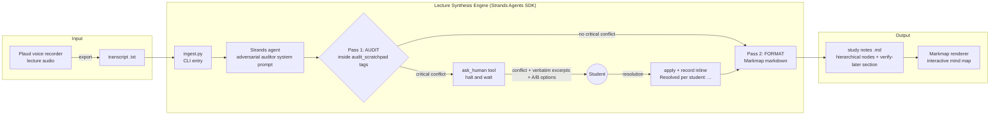

# Architecture - Lecture Synthesis Engine (DRAFT)

Mermaid source below. Render with mermaid.live, the GitHub markdown preview, or the
Mermaid CLI for the repo's PNG/SVG asset.

## Deployment notes

- **Model:** development runs use the Gemini API (`GEMINI_API_KEY` from the
  environment, never hardcoded). Through Strands the model is interchangeable; the
  deployment target is Claude on Amazon Bedrock.
- **Human-in-the-loop:** the halt is a real SDK tool call (`ask_human`). In the CLI
  build it blocks on stdin; the same tool boundary maps to a notification + reply
  loop if deployed (Bedrock AgentCore + an email/SMS surface is the stretch goal).
- **Scheduling:** today it runs on demand per transcript. A watcher (cron locally,
  or EventBridge on AWS) that ingests each new Plaud export as it lands is the
  background-cadence version.
- **Scratchpad quarantine:** audit reasoning lives in `<audit_scratchpad>` tags and
  is stripped from output both by prompt rule and by a regex pass in code (defense
  in depth).

