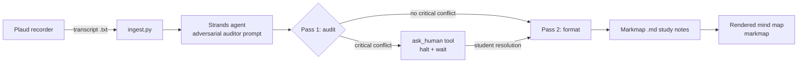

# Lecture Synthesis Engine

An agent that turns recorded lectures into study notes, and refuses to guess when the
lecture contradicts itself.

Built for the AWS **Agents for Humans** hackathon (Everyday Agents track) with the
**Strands Agents SDK**.

## The problem

Students record lectures and run them through AI summarizers. Every summarizer shares
one failure mode: when the transcript contradicts itself (a professor misspeaks, the
transcription garbles a drug mechanism, a Gram stain comes out both positive and
negative), the model quietly picks whichever reading sounds plausible and smooths the
rest away. The student never finds out. The error lands in the study notes, and from
there on the exam.

## What it does

The Lecture Synthesis Engine ingests a raw lecture transcript (exported from a Plaud
recorder) and produces clean, hierarchical study notes in Markmap-compatible markdown.
Before it formats anything, it runs a mandatory hostile audit of the transcript. If it
finds a critical academic conflict, it does not resolve it. It halts mid-run, asks the
student one sharp question with the conflicting excerpts quoted verbatim, waits for the
answer, and only then continues. The resolution is recorded inline in the notes.

Minor noise (typos, garbled filler words, things said once and never contradicted)
never halts the run. It lands in a "verify later" section at the bottom of the notes.

## The product experience

This is a complete loop, not a proof-of-concept script. Transcript goes in, finished
notes come out, and the notes open as an interactive mind map in any Markmap renderer.
When the run halts, the question is built to be answered from a phone in under a
minute: one plain sentence naming the conflict, both excerpts quoted verbatim with
their locations, the likely options (A / B), and nothing else to read. The student
answers once and the run completes. Everything that was not worth stopping for is
still visible, quarantined in the "verify later" section instead of being silently
dropped or silently trusted.

## Who it's for

Any student who records lectures and studies from transcripts. It was built and
dogfooded by one: a pre-nursing student running it on his own Microbiology,
Pharmacology, and Biostatistics lectures during exam week. The input already exists -
recorder apps and devices produce these transcripts every day, so adoption means no
new habit, just a safety net on an existing one. The first clean run on a real lecture
caught the professor genuinely contradicting herself on a Gram stain result, which is
exactly the error a normal summarizer would have silently fixed.

## How it works

The agent runs in two passes, enforced by its system prompt (an "adversarial auditor"
persona whose cardinal rule is: never silently resolve a contradiction).

1. **Pass 1 - AUDIT (mandatory, isolated).** The agent reads the full transcript with
   hostile eyes and hunts for conflicts: a drug's mechanism stated two ways, a
   Gram-stain result contradicting the described morphology, a statistical
   interpretation that flips between segments. The audit happens entirely inside
   `<audit_scratchpad>` tags so no reasoning can leak into the final notes.
2. **The halt.** If a critical conflict exists, the agent invokes a human-in-the-loop
   tool (`ask_human`, implemented with the Strands SDK). The tool pauses the agent and
   surfaces one phone-friendly question: the conflict in one plain sentence, the
   conflicting excerpts quoted verbatim with locations, the most likely options
   (A / B), and a single ask: which is correct? Text alone cannot pause an agent;
   binding the halt to a real tool call is what makes the pause structural instead of
   decorative. When the student answers, the agent applies the resolution and records
   it inline ("Resolved per student: ...").
3. **Pass 2 - FORMAT.** Only after the audit clears (or every halt is resolved) does
   the agent format the transcript into Markmap markdown: hierarchical nodes for key
   concepts, mechanisms, definitions, and formulas, plus the "verify later" section.
   The output is stripped of any scratchpad content as defense in depth.

## Architecture



See `architecture-diagram.md` for the full diagram with deployment notes.

## Repository layout

```
.
├── ingest.py                              # CLI entry point: transcript -> notes
├── adversarial-auditor-prompt-v1.1.md     # system prompt (the "cage")
├── architecture-diagram.md                # mermaid diagram + deployment notes
├── output/                                # generated study notes land here
│   ├── lecture_excerpt_sabotaged.md       # demo: halt on a planted contradiction
│   └── lecture_excerpt_resolved.md        # demo: notes after student resolution
└── README.md
```

## Setup

```bash
pip install strands-agents google-genai
export GEMINI_API_KEY=...   # never hardcoded; read from the environment
```

Package note: the SDK client lives in the `google-genai` package, NOT the older
`google-generativeai` - installing the wrong one is the most likely setup failure.

Model note: development runs use the Gemini API. The agent code is
model-interchangeable through Strands; the deployed target is Claude on Amazon
Bedrock, which keeps the whole stack in the AWS family.

## Usage

```bash
python ingest.py path/to/lecture-transcript.txt
python ingest.py path/to/lecture-transcript.txt --out output/
```

If the run halts, the conflict question prints as a banner. Answer it, fix the
transcript if needed, and re-run. The finished notes land in `output/<name>.md`;
open them with any Markmap renderer to get an interactive mind map.

## Testing: the cage

The failure mode this project exists to defeat is invisible by default, so it is
tested by sabotage. Take a real transcript, plant a contradiction (a bacterium called
Gram-positive in paragraph 1 and Gram-negative in paragraph 5), and run it. The cage
holds if the run halts, quotes both planted lines back verbatim with their locations,
and emits no study notes until the student resolves the conflict.

On the real 08-24 Microbiology staining lecture:

- **Sabotaged transcript:** halt fired, both planted lines quoted back verbatim.
- **Clean transcript:** the run halted anyway, on a contradiction the professor
  actually made. The cage caught a real one.

## Disclosures

- Built during the hackathon Submission Period (Aug 10 - Sep 14, 2026).
- AI coding assistants were used during development, as the rules allow.
- Demo transcripts are real lecture recordings made by the author. No patient,
  classmate, or third-party personal data appears in this repo.

## License

MIT. See `LICENSE`.


## Disclosure (hackathon rules)

- Built during the Agents for Humans hackathon Submission Period (August 10 - September 14, 2026).
- AI coding assistants (Google Gemini; Anthropic Claude via the author's Instinct agent) were used during development, as the rules explicitly allow.
- No pre-existing code is incorporated beyond standard libraries, the Strands Agents SDK, and the model/provider SDKs listed above.
